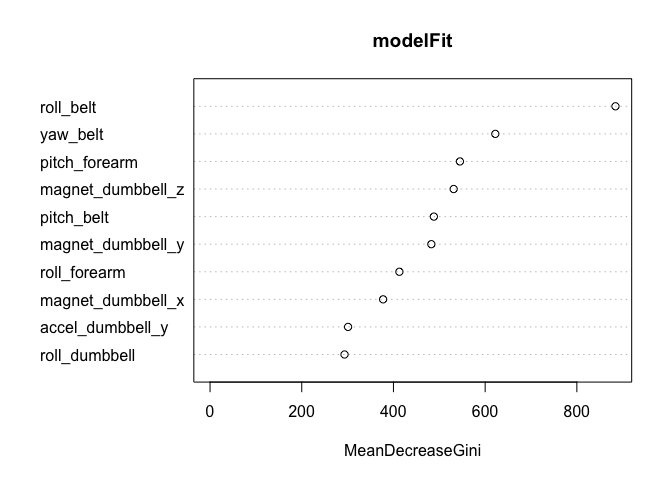

# Practical Machine Learning Project

## Introduction
This project uses data from accelerometers on the belt, forearm, arm, and dumbell of 6 participants.

The goal of this project was to predict the manner in which particpants did the exercise (the "classe" variable in the training set) and to use prediction model to predict 20 different test cases. 

The training data for this project are available [here](https://d396qusza40orc.cloudfront.net/predmachlearn/pml-training.csv)

The test data are available [here](https://d396qusza40orc.cloudfront.net/predmachlearn/pml-testing.csv)

The data for this project come from this [source](http://groupware.les.inf.puc-rio.br/har).  See the website for more information.  


## Load libraries


```r
library(downloader)
library(plyr)
library(caret)
library(randomForest)
```

## Data load

The training and testing data sets were downloaded from the urls above and saved locally. The code below reads them into r.   


```r
testing <- read.csv("./../data/testing.csv",na.strings=c("NA", "#DIV/0!"), header=TRUE, stringsAsFactors=FALSE)
allTraining <- read.csv("./../data/training.csv",na.strings=c("NA", "#DIV/0!"), header=TRUE, stringsAsFactors=FALSE)
```

## Data cleaning

The first step in the data cleaning was to convert the classe variable in the training data to a factor.  

The raw training data contains many NAs.  I chose to eliminate any columns that have 90% or more NAs.  

Also I dropped the columns relating to the user, timestamps, windows, and the row numbers - namely columns X, user_name, new_window, num_window, raw_timestamp_part_1, raw_timestamp_part_2, and cvtd_timestamp.      

I didn't clean the testing data set. 

```r
# Convert classe to factor variable
allTraining$classe <- as.factor(allTraining$classe)
levels(allTraining$classe)
```

```
## [1] "A" "B" "C" "D" "E"
```

```r
#filter out columns with more than 90% NAs
allTraining<- allTraining[, colSums(is.na(allTraining)) < nrow(allTraining) * 0.9]

#drop columns relating to metadata
allTraining <-subset(allTraining, 
                    select=-c(X, user_name, new_window, num_window, raw_timestamp_part_1, raw_timestamp_part_2, cvtd_timestamp))
```
After cleaning, the training data is a dataframe of  19622 obs. of  53 variables.  I inspect the structure below.  


```r
str(allTraining)
```

```
## 'data.frame':	19622 obs. of  53 variables:
##  $ roll_belt           : num  1.41 1.41 1.42 1.48 1.48 1.45 1.42 1.42 1.43 1.45 ...
##  $ pitch_belt          : num  8.07 8.07 8.07 8.05 8.07 8.06 8.09 8.13 8.16 8.17 ...
##  $ yaw_belt            : num  -94.4 -94.4 -94.4 -94.4 -94.4 -94.4 -94.4 -94.4 -94.4 -94.4 ...
##  $ total_accel_belt    : int  3 3 3 3 3 3 3 3 3 3 ...
##  $ gyros_belt_x        : num  0 0.02 0 0.02 0.02 0.02 0.02 0.02 0.02 0.03 ...
##  $ gyros_belt_y        : num  0 0 0 0 0.02 0 0 0 0 0 ...
##  $ gyros_belt_z        : num  -0.02 -0.02 -0.02 -0.03 -0.02 -0.02 -0.02 -0.02 -0.02 0 ...
##  $ accel_belt_x        : int  -21 -22 -20 -22 -21 -21 -22 -22 -20 -21 ...
##  $ accel_belt_y        : int  4 4 5 3 2 4 3 4 2 4 ...
##  $ accel_belt_z        : int  22 22 23 21 24 21 21 21 24 22 ...
##  $ magnet_belt_x       : int  -3 -7 -2 -6 -6 0 -4 -2 1 -3 ...
##  $ magnet_belt_y       : int  599 608 600 604 600 603 599 603 602 609 ...
##  $ magnet_belt_z       : int  -313 -311 -305 -310 -302 -312 -311 -313 -312 -308 ...
##  $ roll_arm            : num  -128 -128 -128 -128 -128 -128 -128 -128 -128 -128 ...
##  $ pitch_arm           : num  22.5 22.5 22.5 22.1 22.1 22 21.9 21.8 21.7 21.6 ...
##  $ yaw_arm             : num  -161 -161 -161 -161 -161 -161 -161 -161 -161 -161 ...
##  $ total_accel_arm     : int  34 34 34 34 34 34 34 34 34 34 ...
##  $ gyros_arm_x         : num  0 0.02 0.02 0.02 0 0.02 0 0.02 0.02 0.02 ...
##  $ gyros_arm_y         : num  0 -0.02 -0.02 -0.03 -0.03 -0.03 -0.03 -0.02 -0.03 -0.03 ...
##  $ gyros_arm_z         : num  -0.02 -0.02 -0.02 0.02 0 0 0 0 -0.02 -0.02 ...
##  $ accel_arm_x         : int  -288 -290 -289 -289 -289 -289 -289 -289 -288 -288 ...
##  $ accel_arm_y         : int  109 110 110 111 111 111 111 111 109 110 ...
##  $ accel_arm_z         : int  -123 -125 -126 -123 -123 -122 -125 -124 -122 -124 ...
##  $ magnet_arm_x        : int  -368 -369 -368 -372 -374 -369 -373 -372 -369 -376 ...
##  $ magnet_arm_y        : int  337 337 344 344 337 342 336 338 341 334 ...
##  $ magnet_arm_z        : int  516 513 513 512 506 513 509 510 518 516 ...
##  $ roll_dumbbell       : num  13.1 13.1 12.9 13.4 13.4 ...
##  $ pitch_dumbbell      : num  -70.5 -70.6 -70.3 -70.4 -70.4 ...
##  $ yaw_dumbbell        : num  -84.9 -84.7 -85.1 -84.9 -84.9 ...
##  $ total_accel_dumbbell: int  37 37 37 37 37 37 37 37 37 37 ...
##  $ gyros_dumbbell_x    : num  0 0 0 0 0 0 0 0 0 0 ...
##  $ gyros_dumbbell_y    : num  -0.02 -0.02 -0.02 -0.02 -0.02 -0.02 -0.02 -0.02 -0.02 -0.02 ...
##  $ gyros_dumbbell_z    : num  0 0 0 -0.02 0 0 0 0 0 0 ...
##  $ accel_dumbbell_x    : int  -234 -233 -232 -232 -233 -234 -232 -234 -232 -235 ...
##  $ accel_dumbbell_y    : int  47 47 46 48 48 48 47 46 47 48 ...
##  $ accel_dumbbell_z    : int  -271 -269 -270 -269 -270 -269 -270 -272 -269 -270 ...
##  $ magnet_dumbbell_x   : int  -559 -555 -561 -552 -554 -558 -551 -555 -549 -558 ...
##  $ magnet_dumbbell_y   : int  293 296 298 303 292 294 295 300 292 291 ...
##  $ magnet_dumbbell_z   : num  -65 -64 -63 -60 -68 -66 -70 -74 -65 -69 ...
##  $ roll_forearm        : num  28.4 28.3 28.3 28.1 28 27.9 27.9 27.8 27.7 27.7 ...
##  $ pitch_forearm       : num  -63.9 -63.9 -63.9 -63.9 -63.9 -63.9 -63.9 -63.8 -63.8 -63.8 ...
##  $ yaw_forearm         : num  -153 -153 -152 -152 -152 -152 -152 -152 -152 -152 ...
##  $ total_accel_forearm : int  36 36 36 36 36 36 36 36 36 36 ...
##  $ gyros_forearm_x     : num  0.03 0.02 0.03 0.02 0.02 0.02 0.02 0.02 0.03 0.02 ...
##  $ gyros_forearm_y     : num  0 0 -0.02 -0.02 0 -0.02 0 -0.02 0 0 ...
##  $ gyros_forearm_z     : num  -0.02 -0.02 0 0 -0.02 -0.03 -0.02 0 -0.02 -0.02 ...
##  $ accel_forearm_x     : int  192 192 196 189 189 193 195 193 193 190 ...
##  $ accel_forearm_y     : int  203 203 204 206 206 203 205 205 204 205 ...
##  $ accel_forearm_z     : int  -215 -216 -213 -214 -214 -215 -215 -213 -214 -215 ...
##  $ magnet_forearm_x    : int  -17 -18 -18 -16 -17 -9 -18 -9 -16 -22 ...
##  $ magnet_forearm_y    : num  654 661 658 658 655 660 659 660 653 656 ...
##  $ magnet_forearm_z    : num  476 473 469 469 473 478 470 474 476 473 ...
##  $ classe              : Factor w/ 5 levels "A","B","C","D",..: 1 1 1 1 1 1 1 1 1 1 ...
```
## Split training data into training and validation set for cross validation.  
Next, I split the training data into two sets - one called training for building the model and one called validate for cross validation. I chose to reserve 30% of the supplied training data for a validation set.  


```r
set.seed(1520)
include<-createDataPartition(allTraining$classe, p=0.7, list=F)
training <- allTraining[include,]

validate <- allTraining[-include,]
```
## Build the model on training set 
I decided to use a random forest to build the model as it's one of the most widely used and highly accurate methods for prediction. After reading the discussion forums, I decided to use the randomForest function from the package of the same name as it's much faster than the rf method in the caret package. 


```r
set.seed(2015)
modelFit <- randomForest(classe ~ ., data=training, importance = FALSE)
print(modelFit)
```

```
## 
## Call:
##  randomForest(formula = classe ~ ., data = training, importance = FALSE) 
##                Type of random forest: classification
##                      Number of trees: 500
## No. of variables tried at each split: 7
## 
##         OOB estimate of  error rate: 0.5%
## Confusion matrix:
##      A    B    C    D    E class.error
## A 3902    4    0    0    0 0.001024066
## B   11 2641    6    0    0 0.006395786
## C    0   11 2382    3    0 0.005843072
## D    0    0   24 2225    3 0.011989343
## E    0    0    0    7 2518 0.002772277
```

In generating the model, 500 trees were built, with 7 variables tried at each split.  

Let's look at the top ten variables by importance


```r
varImpPlot(modelFit, n.var=10)
```

 

The most important variable is roll_belt, followed by yaw_belt.  

##  Out of sample error
The OOB (out of bag) error is an estimate of the out of sample error.  It's very small - only half a percent (0.5%). We will check for overfitting using cross validation in the next section.  

## Cross validation

It's known that random forests can lead to overfitting, so it's important to cross validate the model. I use the model to predict the classe variable on the reserved validate data set. The confusion matrix shows the correctly classified cases on the diagnonal.  The out of sample error is estimated as the proportion of off-diagnonal elements.


```r
pred <- predict(modelFit, newdata=validate)

confusionMatrix(validate$classe, pred)$table
```

```
##           Reference
## Prediction    A    B    C    D    E
##          A 1672    2    0    0    0
##          B    4 1134    1    0    0
##          C    0   10 1016    0    0
##          D    0    0   11  950    3
##          E    0    0    3    1 1078
```

```r
accuracy <- (sum(pred == validate$classe) / length(pred))
accuracy
```

```
## [1] 0.9940527
```

```r
error<- 1- accuracy 
error
```

```
## [1] 0.005947324
```

Using the reserved validate data set, we get an out of sample error of  ~ 0.6 %.  This is close to the OOB error of the model.  The precitions are 99.4% accurate for the validate data set.  The out of sample error for this model is estimated to be about 0.6 %.


##  Predicting classes in the testing data
The final part of the assignment was to use the model to predict the classe variable for the supplied testing data, which comprises 20 test cases.  This occurs below.  


```r
result <- predict(modelFit, newdata= testing)
result <- as.character(result)
result
```

```
##  [1] "B" "A" "B" "A" "A" "E" "D" "B" "A" "A" "B" "C" "B" "A" "E" "E" "A"
## [18] "B" "B" "B"
```


## Write output files for submission
The following code writes the output files for submission.  

```r
pml_write_files = function(x){
  n = length(x)
  for(i in 1:n){
    filename = paste0("problem_id_",i,".txt")
    write.table(x[i],file=filename,quote=FALSE,row.names=FALSE,col.names=FALSE)
  }
}

pml_write_files(result)
```


